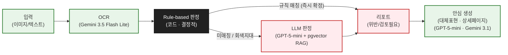
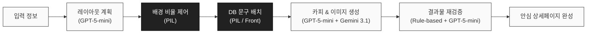
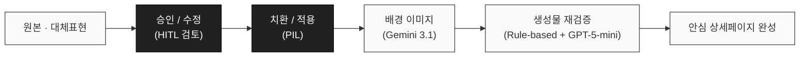
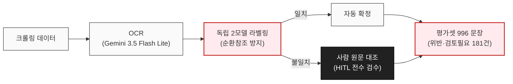

<div align="center">

# 🌿 바름 (barum)

### **과대, 부당 광고 사전검수 컴플라이언스 AI 에이전트**

이커머스 상세페이지의 과대·부당광고(식약처 「화장품법」 및 글로벌 규제)를  
**Rule-based 정밀 판정 + RAG(pgvector) + AI 생성·재검증**으로 해결하는 Closed-Loop 솔루션입니다.

<br/>

[](#)
[](#)
[](#)
[](#)
[](#)
[](#)

</div>

---

## 📌 목차 (Table of Contents)

1. [프로젝트 소개 (Overview)](#-프로젝트-소개-overview)
2. [핵심 가치 & Closed-Loop (Key Principles)](#-핵심-가치--closed-loop-key-principles)
3. [핵심 파이프라인 아키텍처 (Architecture)](#-핵심-파이프라인-아키텍처-architecture)
   - [① 규제 검증 파이프라인 (검사에서 생성까지)](#1-규제-검증-파이프라인-검사에서-생성까지)
   - [② 상세페이지 안심 생성 & 개선 파이프라인](#2-상세페이지-안심-생성--개선-파이프라인)
   - [③ 신뢰할 수 있는 평가셋(Ground Truth) 구축 파이프라인](#3-신뢰할-수-있는-평가셋ground-truth-구축-파이프라인)
4. [글로벌 수출 프리플라이트 (US Export Preflight)](#-글로벌-수출-프리플라이트-us-export-preflight)
5. [도메인 지식 & 규제 체계 (Regulatory Grounding)](#-도메인-지식--규제-체계-regulatory-grounding)
6. [기술 스택 (Tech Stack)](#-기술-스택-tech-stack)
7. [디렉터리 구조 (Repository Structure)](#-디렉터리-구조-repository-structure)
8. [빠른 시작 가이드 (Quick Start)](#-빠른-시작-가이드-quick-start)

---

## 💡 프로젝트 소개 (Overview)

**바름(barum)** 은 이커머스 상세페이지의 **과대, 부당 광고 AI 사전검수 컴플라이언스 에이전트**입니다.

상세페이지 제작 시 복잡하고 엄격한 **식약처 표시·광고 규제 및 해외 수출 규정**을 준수해야 하는 셀러와 브랜드사를 위해,  
단순 적발에 그치지 않고 **탐지부터 안전 대체표현 제안, 안심 상세페이지 생성, 셀프 재검증, 수출 사전 검증(Preflight)** 까지 원스톱으로 지원합니다.

> **"판단은 사람, 순환·개선·행동은 에이전트"**  
> 단발성 탐지가 아닌 **닫힌 순환(Closed-Loop)** 구조로 안전한 이커머스 광고 환경을 만듭니다.

---

## 🔄 핵심 가치 & Closed-Loop (Key Principles)

1. **규칙 우선(Rule-based) & 0-비용 결정적 처리**
   - 명확한 위반 및 법정 허용 표현은 **Rule-based 필터**에서 즉시 확정하여 비용 0원과 100% 재현성을 보장합니다.
   - 판단이 갈리는 모호한 회색지대만 **GPT-5-mini**에 위임합니다.
2. **RAG Grounding (Supabase pgvector)**
   - 법령 조항, 식약처 가이드라인, 실제 행정처분 적발 사례를 pgvector로 유사도 검색하여 판정의 법적 근거를 명확하게 제시합니다.
3. **자유창작 금지 & 조건표 기반 안심 생성**
   - 효능·기능 표현은 AI의 임의 창작을 엄격히 제한하고, 검증된 인정문구 및 안전 조건표로 치환합니다.
4. **생성물 셀프 재검증 (Self-Consistency Recheck)**
   - AI가 생성한 결과물을 다시 바름의 규제 검증 엔진에 통과시켜 잔여 위반 위험을 최종 차단합니다.
5. **글로벌 규제 확장성 (교체형 레퍼런스 팩)**
   - 판정 코어를 유지한 채 규제 데이터만 교체하여 미국 등 해외 수출 규제(FDA OTC)를 사전에 검증합니다.

---

## 🏗️ 핵심 파이프라인 아키텍처 (Architecture)

### 1. 규제 검증 파이프라인 (검사에서 생성까지)

광고 이미지와 텍스트를 입력받아 Rule-based 필터와 LLM RAG를 거쳐 신속·정확하게 위반 여부를 판정하고 안심 생성으로 연결합니다.



> 💡 **핵심 설계 원칙**  
> *"Rule-based(코드)에서 끝난 문장은 LLM으로 가지 않습니다 (비용 0 · 재현성 보장). 회색지대만 GPT-5-mini에 위임하며, 법적 근거 조항은 코드가 매핑표에서 직접 조회합니다."*

---

### 2. 상세페이지 안심 생성 & 개선 파이프라인

#### 🔹 [신규 생성 모드 (Create Mode)]
원료/인증서 데이터와 레이아웃 계획을 바탕으로 처음부터 규제 안심 상세페이지를 생성합니다.



#### 🔹 [개선/치환 모드 (Improve Mode)]
기존 상세페이지의 위반 요소를 검토하고 안전한 대체 표현으로 1-Click 치환합니다.



---

### 3. 신뢰할 수 있는 평가셋(Ground Truth) 구축 파이프라인

모델의 편향과 순환참조를 방지하기 위해 독립된 2개 모델 교차 검증과 사람 원문 대조(HITL)를 결합한 정답셋 구축 프로세스를 운영합니다.



> 💡 **핵심 평가 원칙**  
> *"우리 판정으로 우리를 채점하지 않습니다. 두 모델의 판정이 갈린 문장만 사람이 직접 원문과 대조(Human-in-the-Loop)하여 신뢰할 수 있는 골든셋을 구축합니다."*

---

## ✈️ 글로벌 수출 프리플라이트 (US Export Preflight)

K-뷰티 브랜드가 해외(미국) 시장에 진출할 때 직면하는 **국가별 규제 격차(Regulatory Gap)**를 사전에 점검하는 프리플라이트 검증 모듈입니다.

```
[한국 상품 정보 (문구/전성분)] ➔ [US Sunscreen Preflight Engine]
                                        │
        ┌───────────────────────────────┴───────────────────────────────┐
        ▼                                                               ▼
 [SPF / 자외선차단 표방 감지]                               [전성분 & FDA M020 모노그래프 대조]
  ➔ 미국 내 OTC 의약품 분류 위험 경고                         ➔ FDA 승인 16종 + 최종오더(Bemotrizinol 등) 매칭
                                                                ➔ 최대 함량 초과 및 미승인 원료 지목
```

- **아키텍처 원칙 (교체형 레퍼런스 팩)**:
  - 검증 엔진 코어(`RagJudge`)를 유지한 채, 국가별 규제 데이터팩(`reference/cosmetic_us/`)만 교체하여 다국가 확장이 가능한 유연한 구조를 채택했습니다.
- **핵심 검증 항목 (미국 자외선차단제)**:
  - **OTC 분류 경고**: 국내에서는 기능성화장품인 자외선차단(SPF) 제품이 미국에서는 **일반의약품(OTC Drug)**으로 엄격히 분류되는 법적 리스크 사전 안내
  - **FDA 모노그래프 원문 대조**: **FDA OTC Monograph M020 (21 CFR 352.10)** 기준 승인 성분 16종 및 개정 최종오더(Bemotrizinol 등) 대조
  - **원료 및 함량 검증**: 미국 미승인 자외선차단 원료 사용 여부 및 배합 한도 초과 정밀 스캔

---

## ⚖️ 도메인 지식 & 규제 체계 (Regulatory Grounding)

바름은 **식약처 「화장품법」 제13조(부당한 표시·광고 행위 등의 금지)** 개정 기준 5호 체계를 철저하게 준수합니다.

| 호수 | 위반 유형 명칭 | 주요 적발 사례 및 판정 기준 | 바름 대응 방식 |
|:---|:---|:---|:---|
| **1호** | **의약품 오인** | 질병 치료/예방 표방, 아토피, 여드름 치료, 염증 완화, 피부 재생, MTS/시술 묘사 | **Rule-based 즉시 위반 확정** + 안전 보습 문구 치환 |
| **2호** | **기능성화장품 오인** | 미백·주름·자외선 기능성 비인증 또는 고시 기준함량(알부틴 2~5% 등) 미달 | **전성분 & 함량 대조 엔진**으로 심사 통과 여부 검증 |
| **3호** | **의약외품 등 오인** | 소독, 살균, 탈모 치료, 체지방 분해 등 화장품 범위를 벗어난 표방 | 키워드 정합 및 **pgvector 적발사례 매칭** |
| **5호** | **거짓·과장·기만** | 최고, 완벽, 1위 등 입증 불가 절대적 수식어, 경쟁사 비교 비방 | **GPT-5-mini 문맥 분석** 및 완화 수식어 추천 |

---

## 🛠️ 기술 스택 (Tech Stack)

### AI & VLM Models
- **Judge & Content Generation**: `OpenAI GPT-5-mini` (`OPENAI_MODEL=gpt-5-mini`)
- **OCR Engine**: `Google Gemini 3.5 Flash Lite` (`MODEL_NAME=gemini-3.5-flash-lite`)
- **Image Generation Engine**: `Google Gemini 3.1 Flash Lite Image` (`IMAGE_MODEL_NAME=gemini-3.1-flash-lite-image`)

### Backend
- **Framework**: Python 3.11, FastAPI, Pydantic v2
- **Database & Storage**: Supabase (`PostgreSQL`, `pgvector`, `Storage`)
- **Image Processing**: Pillow (PIL), NumPy

### Frontend
- **Framework**: Next.js 14+ (App Router), TypeScript
- **Styling**: Tailwind CSS, Vanilla CSS

---

## 📁 디렉터리 구조 (Repository Structure)

```
barum/
├── backend/
│   ├── src/barum/
│   │   ├── judge/          # Rule-based 및 RagJudge 판정 엔진
│   │   ├── generate/       # 콘텐츠 안심 생성(create/improve) & 재검증
│   │   ├── reference/      # 화장품 규정 데이터 & pgvector RAG 리트리버
│   │   ├── preprocess/     # OCR(Gemini) & 타일 분할
│   │   └── storage/        # Supabase 클라이언트 및 이력/증거 보존
│   ├── scripts/            # 평가셋 검증, OCR 실행, 사례 적재 스크립트
│   ├── tests/              # 유닛 및 통합 테스트 (pytest)
│   ├── db/schema.sql       # Supabase 스키마 (pgvector 포함)
│   └── requirements.txt    # 백엔드 의존성 매니페스트
├── frontend/               # Next.js 프론트엔드 웹 애플리케이션
├── reference/
│   ├── cosmetic_kr/        # 식약처 법령, T1~T6 금지표현, 기능성 성분표
│   └── cosmetic_us/        # 미국 FDA OTC Monograph M020 규제 레퍼런스
├── design/                 # 목업, 로고 및 디자인 핸드오프
└── docs/                   # 라벨링 기준서, 판정 카드, 수출 프리플라이트 가이드
```

---

## 🚀 빠른 시작 가이드 (Quick Start)

### 1. Backend 셋업

```bash
# 1. 저장소 클론 및 이동
cd barum/backend

# 2. 가상환경 생성 및 패키지 설치
python3.11 -m venv venv
source venv/bin/activate
pip install -r requirements.txt

# 3. 환경 변수 설정 (.env)
cp .env.example .env
# .env 파일 내 API Key 설정:
# OPENAI_API_KEY, GOOGLE_API_KEY, SUPABASE_URL, SUPABASE_KEY

# 4. 백엔드 API 서버 실행
uvicorn api.app:app --host 0.0.0.0 --port 8000 --reload
```

### 2. Frontend 셋업

```bash
cd barum/frontend

# 패키지 설치 및 개발 서버 실행
npm install
npm run dev
```

### 3. 테스트 실행

```bash
cd barum/backend
./venv/bin/python -m pytest tests/ -q
```

---

<div align="center">

### 👥 Team 케르베로스

**신하니 (팀장) · 박정빈 · 전대수**

<br/>

**바름 (barum)** — *과대, 부당 광고 AI 사전검수 컴플라이언스 에이전트*

</div>


